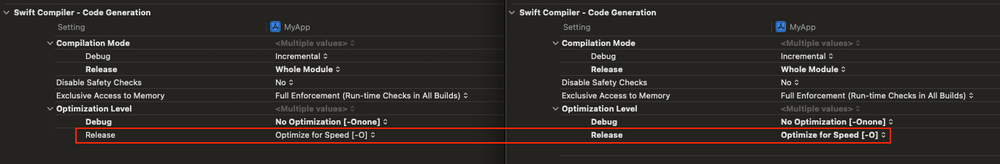
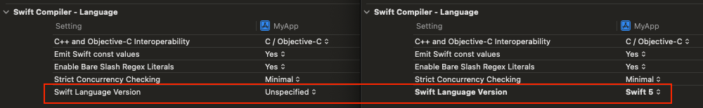
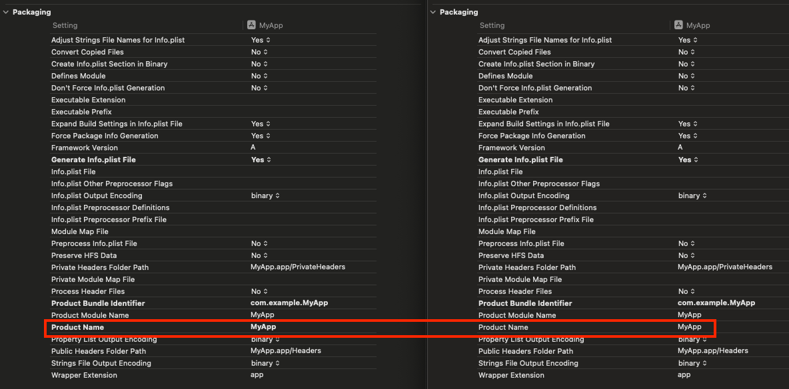
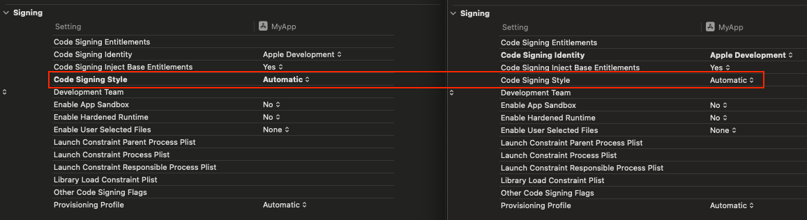
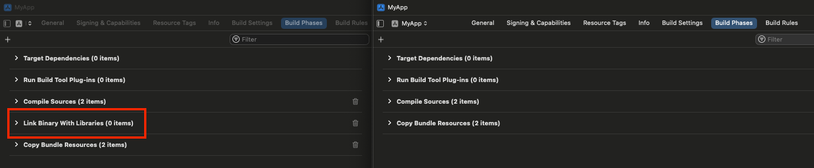

# Discrepancies with Xcode-Generated Projects

When generating this project using XcodeGen, the following settings technically stray slightly from what you would encounter when creating a new project via the Xcode UI.

However, many of these changes are extremely minor or even just cosmetic differences in the Xcode UI so they _shouldn't_ have any adverse affects in real-world scenarios.

## Project-Level Discrepancies

### Build Settings

#### Packaging

**Product Name (`PRODUCT_NAME`)**

* Xcode default - _nonexistent_ (unset/inherited value)
* XcodeGen default - _nonexistent_ (explicit/overridden value)

This difference should have no real-world impact.

#### Swift Compiler - Code Generation

**Optimization Level - Release (`SWIFT_OPTIMIZATION_LEVEL`)**

* Xcode default - `Optimize for Speed [-O]` (unset/inherited value)
* XcodeGen default - `Optimize for Speed [-O]` (explicit/overridden value)

Since the overridden value is the same as the default value, this should not have any meaningful effect on the overall project settings.

#### Swift Compiler - Language

**Swift Language Version (`SWIFT_VERSION`)**

* Xcode default - `Unspecified` (unset/inherited value)
* XcodeGen default - `Swift 5` (explicit/overridden value)

Although these values differ, there should be no real-world impact, assuming you want to use Swift 5 by default.

#### User-Defined

**`CLANG_CXX_LIBRARY`**

* Xcode default - _nonexistent_
* XcodeGen default - `libc++` (explicit/overridden value)

This difference has the _potential_ to impact something if it makes use of the `CLANG_CXX_LIBRARY` variable during the build process, but I'm not currently aware of any adverse effects.

## MyApp Target Discrepancies

### MyApp - General

#### Frameworks, Libraries, and Embedded Content

* Xcode default - section title shows as "Frameworks, Libraries, and Embedded Content"
* XcodeGen default - section title shows as "Embedded Content"

This difference appears to be purely cosmetic and should have no real-world impact.

### MyApp - Build Settings

#### Architectures

**Base SDK (`SDKROOT`)**

* Xcode default - `iOS` (unset/inherited value)
* XcodeGen default - `iOS` (explicit/overridden value)

This difference should have no real-world impact.

#### Packaging

**Product Name (`PRODUCT_NAME`)**

* Xcode default - `MyApp` (explicit/overridden value)
* XcodeGen default - `MyApp` (unset/inherited value)

This difference should have no real-world impact.

#### Signing

**Code Signing Identity (`CODE_SIGN_IDENTITY`)**

* Xcode default - `Apple Development` (inherited from project)
* XcodeGen default - `Apple Development` (explicit/overridden value)

This difference should have no real-world impact.

By default, XcodeGen sets `CODE_SIGN_IDENTITY` to the older Xcode default of "iOS Developer", which can cause build issues. At some point, [this XcodeGen issue](https://github.com/yonaskolb/XcodeGen/issues/691) might get resolved, in which case we can remove the explicit `CODE_SIGN_IDENTITY` value from the `project.yml` file.

**Code Signing Style (`CODE_SIGN_STYLE`)**

* Xcode default - `Automatic` (explicit/overridden value)
* XcodeGen default - `Automatic` (unset/inherited value)

This difference should have no real-world impact.

#### Swift Compiler - Language

**Swift Language Version (`SWIFT_VERSION`)**

* Xcode default - `Swift 5` (explicit/overridden value)
* XcodeGen default - `Swift 5` (unset/inherited value)

#### User-Defined

**`CLANG_CXX_LIBRARY`**

* Xcode default - _nonexistent_
* XcodeGen default - `libc++` (unset/inherited value)

This difference has the _potential_ to impact something if it makes use of the `CLANG_CXX_LIBRARY` variable during the build process, but I'm not currently aware of any adverse effects.

### MyApp - Build Phases

#### "Link Binary With Libraries" Build Step

* Xcode default - "Link Binary With Libraries" step exists
* XcodeGen default - "Link Binary With Libraries" step does not exist

This difference should have no real-world impact, at least until external libraries need to be integrated into the project, at which time, the "Link Binary With Libraries" build step can be added manually.

## Project Navigator Discrepancies

### File Order

* Xcode default - `MyAppApp.swift` at top
    * `MyAppApp.swift`
    * `ContentView.swift`
    * `Assets.xcassets`
* XcodeGen default - alphabetical
    * `Assets.xcassets`
    * `ContentView.swift`
    * `MyAppApp.swift`

This difference should have no real-world impact and is easily correctable by dragging the files around to the desired order.

### Products Folder

* Xcode default - _nonexistent_
* XcodeGen default - `Products/MyApp.app`

[As of Xcode 13](https://developer.apple.com/documentation/xcode-release-notes/xcode-13-release-notes#New-Features), Xcode no longer shows the "Products" folder in the project navigator, but it still exists in the file system. XcodeGen appears to be generating the "Products" folder explicitly. However, this difference should have no real-world impact.

## MyAppTests Target Discrepancies

### MyAppTests - General

#### Frameworks and Libraries

* Xcode default - "Frameworks and Libraries" section exists
* XcodeGen default - "Frameworks and Libraries" section does not exist

This difference should have no real-world impact, at least until external libraries need to be integrated into the project, at which time, the "Frameworks and Libraries" section can be added manually.

## MyAppTests - Build Settings

#### Architectures

**Base SDK (`SDKROOT`)**

* Xcode default - `iOS` (unset/inherited value)
* XcodeGen default - `iOS` (explicit/overridden value)

This difference should have no real-world impact.

#### Deployment

**iOS Deployment Target (`IPHONEOS_DEPLOYMENT_TARGET`)**

* Xcode default - `17.2` (explicit/overridden value)
* XcodeGen default - `17.2` (unset/inherited value)

This difference should have no real-world impact.

#### Linking - General

**Runpath Search Paths (`LD_RUNPATH_SEARCH_PATHS`)**

* Xcode default - `@loader_path/Frameworks` (unset/inherited value)
* XcodeGen default - `@loader_path/Frameworks @executable_path/Frameworks @loader_path/Frameworks` (explicit/overridden value)

This difference could have an impact based on project configuration, but it's unlikely to be a problem in most cases.

#### Localization

**Use Compiler to Extract Swift Strings (`SWIFT_EMIT_LOC_STRINGS`)**

* Xcode default - `No` (explicit/overridden value)
* XcodeGen default - `No` (unset/inherited value)

This difference should have no real-world impact.

#### Packaging

**Product Name (`PRODUCT_NAME`)**

* Xcode default - `MyAppTests` (explicit/overridden value)
* XcodeGen default - `MyAppTests` (unset/inherited value)

This difference should have no real-world impact.

#### Signing

**Code Signing Style (`CODE_SIGN_STYLE`)**

* Xcode default - `Automatic` (explicit/overridden value)
* XcodeGen default - `Automatic` (unset/inherited value)

This difference should have no real-world impact.

#### Swift Compiler - Language

**Swift Language Version (`SWIFT_VERSION`)**

* Xcode default - `Swift 5` (explicit/overridden value)
* XcodeGen default - `Swift 5` (unset/inherited value)

This difference should have no real-world impact.

#### User-Defined

**`CLANG_CXX_LIBRARY`**

* Xcode default - _nonexistent_
* XcodeGen default - `libc++` (unset/inherited value)

This difference has the _potential_ to impact something if it makes use of the `CLANG_CXX_LIBRARY` variable during the build process, but I'm not currently aware of any adverse effects.

### MyAppTests - Build Phases

#### "Link Binary With Libraries" Build Step

* Xcode default - "Link Binary With Libraries" step exists
* XcodeGen default - "Link Binary With Libraries" step does not exist

This difference should have no real-world impact, at least until external libraries need to be integrated into the project, at which time, the "Link Binary With Libraries" build step can be added manually.

#### "Copy Bundle Resources" Build Step

* Xcode default - "Copy Bundle Resources" step exists
* XcodeGen default - "Copy Bundle Resources" step does not exist

This difference should have no real-world impact, at least until external resources need to be integrated into the project, at which time, the "Copy Bundle Resources" build step can be added manually.

## MyAppUITests Target Discrepancies

### MyAppUITests - General

#### Frameworks and Libraries

* Xcode default - "Frameworks and Libraries" section exists
* XcodeGen default - "Frameworks and Libraries" section does not exist

This difference should have no real-world impact, at least until external libraries need to be integrated into the project, at which time, the "Frameworks and Libraries" section can be added manually.

### MyAppUITests - Build Settings

#### Architectures

**Base SDK (`SDKROOT`)**

* Xcode default - `iOS` (unset/inherited value)
* XcodeGen default - `iOS` (explicit/overridden value)

This difference should have no real-world impact.

#### Linking - General

**Bundle Loader (`BUNDLE_LOADER`)**

* Xcode default - _nonexistent_ (unset/inherited value)
* XcodeGen default - _nonexistent_ (explicit/overridden value)

This difference should have no real-world impact.

**Runpath Search Paths (`LD_RUNPATH_SEARCH_PATHS`)**

* Xcode default - `@loader_path/Frameworks` (unset/inherited value)
* XcodeGen default - `@loader_path/Frameworks @executable_path/Frameworks @loader_path/Frameworks` (explicit/overridden value)

This difference could have an impact based on project configuration, but it's unlikely to be a problem in most cases.

#### Localization

**Use Compiler to Extract Swift Strings (`SWIFT_EMIT_LOC_STRINGS`)**

* Xcode default - `No` (explicit/overridden value)
* XcodeGen default - `No` (unset/inherited value)

This difference should have no real-world impact.

#### Packaging

**Product Name (`PRODUCT_NAME`)**

* Xcode default - `MyAppUITests` (explicit/overridden value)
* XcodeGen default - `MyAppUITests` (unset/inherited value)

This difference should have no real-world impact.

#### Signing

**Code Signing Style (`CODE_SIGN_STYLE`)**

* Xcode default - `Automatic` (explicit/overridden value)
* XcodeGen default - `Automatic` (unset/inherited value)

This difference should have no real-world impact.

#### Swift Compiler - Language

**Swift Language Version (`SWIFT_VERSION`)**

* Xcode default - `Swift 5` (explicit/overridden value)
* XcodeGen default - `Swift 5` (unset/inherited value)

This difference should have no real-world impact.

#### User-Defined

**`CLANG_CXX_LIBRARY`**

* Xcode default - _nonexistent_
* XcodeGen default - `libc++` (unset/inherited value)

This difference has the _potential_ to impact something if it makes use of the `CLANG_CXX_LIBRARY` variable during the build process, but I'm not currently aware of any adverse effects.

### MyAppUITests - Build Phases

#### "Link Binary With Libraries" Build Step

* Xcode default - "Link Binary With Libraries" step exists
* XcodeGen default - "Link Binary With Libraries" step does not exist

This difference should have no real-world impact, at least until external libraries need to be integrated into the project, at which time, the "Link Binary With Libraries" build step can be added manually.

#### "Copy Bundle Resources" Build Step

* Xcode default - "Copy Bundle Resources" step exists
* XcodeGen default - "Copy Bundle Resources" step does not exist

This difference should have no real-world impact, at least until external resources need to be integrated into the project, at which time, the "Copy Bundle Resources" build step can be added manually.
